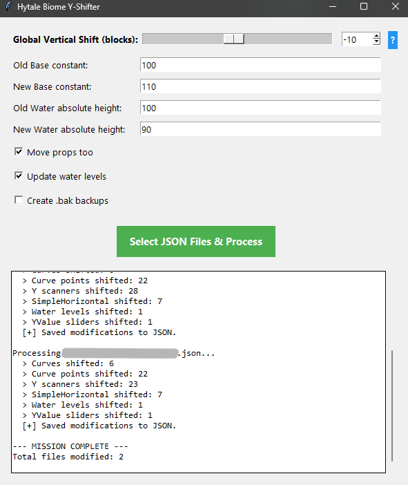

# Hytale Biome Y‑Shifter (GUI)

Small Tkinter GUI to apply a constant vertical Y shift to HytaleGenerator (WorldGen V2) biome JSON files.



Typical uses:

- move an entire biome up/down without changing its internal shapes
- migrate a biome when the framework `Base` constant changes (e.g. 50 → 100)

## Run

```bash
python biome_y_shifter_gui.py
```

Then click *Select JSON Files & Process* and pick one or more `.json` files.

## What it changes

It scans the JSON and shifts height-related fields in these nodes:

- `Slider` (only when it has `YValue` inputs): `SlideY`
- `Linear` (only when `Axis = "Y"`): `Range.MinInclusive`, `Range.MaxExclusive`
- `CurveMapper` (only when `Curve.Type = "Manual"`): `Points[].In` (only when the values look like *absolute* heights)
- `SimpleHorizontal`: `TopY`, `BottomY` (only when `TopBaseHeight` / `BottomBaseHeight` are `"Base"` or `"Water"`)
- Water `SimpleHorizontal` nodes: also `TopY`, `BottomY` (when detected as water by `Material -> Constant -> Material.Fluid` starting with `"water"`)

## How the shift is computed

The tool computes two deltas from your inputs:

- `delta_y = Old Base - New Base`
- `water_delta = New Water - Old Water`

Rules:

- For non-water nodes, it adds `delta_y` to the affected Y fields.
- For detected water `SimpleHorizontal` nodes (when *Update water levels* is enabled), it adds `delta_y + water_delta`.

### Global Vertical Shift slider

If you use ***Global Vertical Shift (blocks)*** with value `s`:

- terrain (and optionally props) shift by `+s`
- water shifts by the same `+s` (when water updates are enabled)

## Options

- *Move props too*: include/exclude values under the `"Props"` subtree.
- *Update water levels*: updates detected water `SimpleHorizontal` nodes.
- *Create .bak backups*: writes `yourfile.json.bak` next to the JSON before saving changes.

## Reverting

This tool edits files directly (in-place) when you press `Select JSON Files & Process`.

If you enabled backups, restore the `.bak` file (or copy it back over the modified `.json`).
